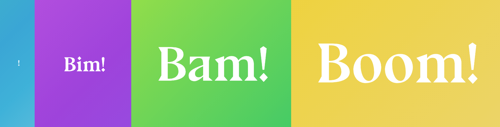

# Bim Bam Boom!

#### A simple responsive web page created to show the use of media queries at various viewport sizes.

Features a subtle animated gradient background.



## Setup

To get view this project in your browser, clone this repo and then in your terminal run:

```
cd bim-bam-boom
npm i
npm run dev
```
Open a new browser window/tab and run:

```
https://localhost3000
```

You may need to refresh the page. Your browser should now display the project. Adjust the viewport to examine the different states of the app.
